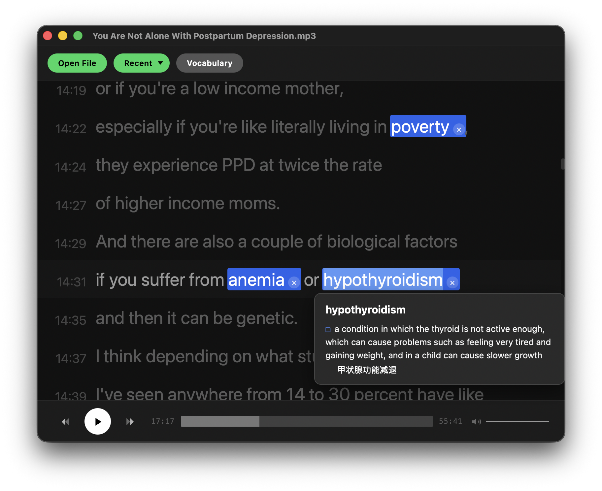
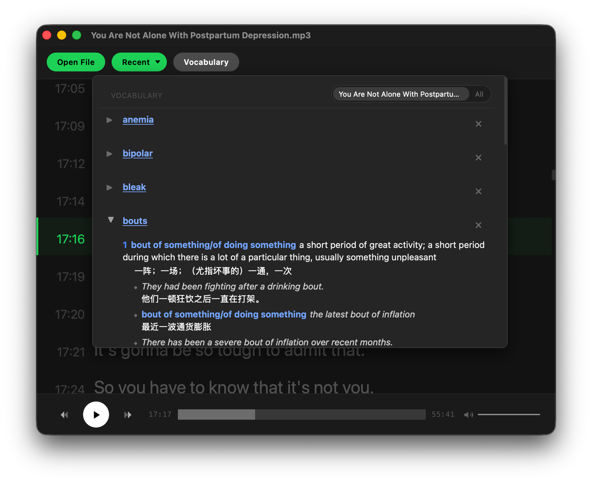

# podlrc

podlrc is a tiny macOS player for podcasts, interviews, and language-learning
audio with synced LRC lyrics. It is just a small zip, starts quickly, stays
offline, and is ready to use without a heavy app bundle.

I built it because I wanted a lyric player that felt right on macOS and made
listening practice easy.

It keeps the basics close at hand: MP3 playback, synced lyrics, seeking,
recent files, playback-position restore, macOS Dictionary lookup, and a
per-podcast vocabulary book.

## Screenshots





## Installation

1. Go to the project's **[GitHub Releases](https://github.com/geohuz/podlrc/releases)** page.
2. Download the latest macOS archive, for example:

   ```text
   podlrc-0.1.0-macos-arm64.zip
   ```

3. Extract the zip file.
4. Run the `podlrc` binary:

   ```sh
   ./podlrc
   ```

The release is a plain zip instead of a signed DMG. The binary is not
codesigned, so on first launch macOS may block it. If that happens, either
right-click `podlrc` and choose **Open**, or remove the quarantine attribute:

```sh
xattr -d com.apple.quarantine podlrc
```

## Usage

### Open audio

Click **Open** and choose an MP3 file. podlrc looks for a matching `.lrc` file
next to the audio file, using the same basename:

```text
episode.mp3
episode.lrc
```

The window title shows the opened audio filename. Playback history and the last
position are saved automatically when you open a file, open a recent file, or
quit the app.

### Playback controls

- **Space** — play / pause
- **←** — jump back 10 seconds
- **→** — jump forward 10 seconds
- **↑** — jump to the previous lyric line
- **↓** — jump to the next lyric line
- **Enter** — repeat the current highlighted lyric line
- Progress bar — drag to seek
- Volume slider — drag to adjust volume

### Lyrics

Lyrics scroll and highlight in sync with playback. Click a lyric line to seek to
that timestamp.

Font size shortcuts:

- **⌘+ / Ctrl+** — increase lyric font size
- **⌘- / Ctrl-** — decrease lyric font size
- **⌘0 / Ctrl+0** — reset lyric font size

### Recent files

After opening a file, **Recent** appears near the Open button. Click it to reopen
recent audio files. podlrc restores the last saved playback position for each
file.

### Vocabulary

Click a word in the lyrics to look it up with macOS Dictionary and save it to
**Vocabulary**. Clicking an already saved word opens the dictionary popup but
does not save a duplicate. Click the same selected word again to close the
popup.

Vocabulary stores each word once. Saved words are highlighted with a blue
background wherever they appear in the lyrics. Click the small **×** next to a
highlighted word to remove it directly from the lyrics, or open **Vocabulary**
to review saved words:

- Vocabulary defaults to the current podcast. Use **All** to show saved words
  from every podcast.
- Click a word entry to jump back to its lyric line.
- Click the triangle to expand or collapse a definition.
- Click **×** to remove a word.
- Removing a word also removes its lyric highlight.

### Dictionary lookup

podlrc uses Apple's built-in Dictionary services. It does not bundle a
dictionary and it does not go online for word lookup.

When you click a word, podlrc sends the surrounding lyric line to Apple's
Dictionary services so macOS can detect longer phrases where possible. For
example, clicking `obsessive-compulsive` in `obsessive-compulsive disorder` can
use the longer phrase if the system dictionary recognizes it.

The lookup result follows the order configured in Dictionary.app:

1. Open Apple's **Dictionary** app.
2. Open **Dictionary > Settings**.
3. Enable the dictionary you want to use.
4. Drag that dictionary to the top of the dictionary list.

After that, podlrc will receive that dictionary's result first when you click a
word. For example, if you want New Oxford American Dictionary results, put that
dictionary first. If you want `oaldpe-apple`, put `oaldpe-apple` first.

`oaldpe-apple` is not bundled with podlrc. If you want to use it, install it
separately from [genzj/oaldpe-10th-apple](https://github.com/genzj/oaldpe-10th-apple),
then enable it in Dictionary.app and move it to the top of the dictionary list.

## Developer guide

### Project layout

```text
src/
  dictionary_formatters.js          # formatter registry and normalization entry
  dictionary_formatters/
    common.js                       # shared helpers and plain fallback
    noad.js                         # New Oxford American Dictionary formatter
    oaldpe_apple.js                 # oaldpe-apple formatter
  native/
    macos_dictionary.c              # macOS Dictionary bridge
    miniaudio_impl.c                # miniaudio bridge
  third_party/
    miniaudio.h                     # vendored miniaudio header
tools/
  verify_audio.nim                  # audio validation helper
```

### Build

```sh
nim c src/main.nim
```

The build writes the app binary to `./podlrc` via `config.nims`.

### Release archive

Build a macOS release zip:

```sh
nimble release
```

This creates:

```text
dist/podlrc-<version>-macos-<arch>.zip
dist/podlrc-<version>-macos-<arch>.zip.sha256
```

The zip contains the `podlrc` binary and `README.md`. The binary is not
codesigned, so first-time users may need to right-click **Open** or remove the
quarantine attribute:

```sh
xattr -d com.apple.quarantine podlrc
```

To compile the audio validation helper:

```sh
nim c --path:src --app:console \
  --passL:"-framework CoreAudio -framework AudioToolbox" \
  tools/verify_audio.nim
```

### Dictionary formatter registry

podlrc keeps dictionary support intentionally small and explicit. The app does
not choose a Dictionary.app backend. macOS returns the first matching result
based on the user's Dictionary.app order; podlrc only recognizes and normalizes
the returned HTML.

Currently supported formatter handlers:

- `noad` — New Oxford American Dictionary
- [`oaldpe-apple`](https://github.com/genzj/oaldpe-10th-apple) — oaldpe-apple installed in Apple Dictionary

If no formatter matches, podlrc falls back to a plain text formatter.

### Finding macOS dictionary identifiers

When adding support for another Apple Dictionary dictionary, inspect the user's
DictionaryServices preferences:

```sh
defaults export com.apple.DictionaryServices -
```

Look for the `DCSActiveDictionaries` array. Apple-provided dictionaries are often
listed by identifier, for example `com.apple.dictionary.NOAD`; user-installed
dictionaries are often listed by `.dictionary` path. Use that output to document
which system dictionary your formatter expects, then choose a stable podlrc
registry id such as `noad` or `oaldpe-apple`.

### Adding a dictionary formatter

1. Add a new file under `src/dictionary_formatters/`, for example
   `my_dictionary.js`.
2. Implement a formatter object with `id`, `label`, `description`, `matches`,
   and `format`.
3. Add the file to `DictionaryFormattersJs` in `src/main.nim`, before
   `dictionary_formatters.js`.
4. Add the formatter object to `dictionaryFormatterRegistry` in
   `src/dictionary_formatters.js`.

Example formatter:

```js
function formatMyDictionaryDefinition(doc, word) {
  return formatPlainDictionaryDefinition('', word, doc);
}

var myDictionaryFormatter = {
  id: 'my-dictionary',
  label: 'My Dictionary',
  description: 'Short note for maintainers',
  matches: function(doc) {
    return !!doc.querySelector('your dictionary marker');
  },
  format: formatMyDictionaryDefinition
};
```

Then register it:

```js
var dictionaryFormatterRegistry = [
  noadFormatter,
  oaldpeAppleFormatter,
  myDictionaryFormatter
];
```

Formatter output should be podlrc's normalized vocabulary-card HTML, not the
dictionary's raw HTML. Use helpers from `common.js` such as
`dictionaryNodeText()` and `formatPlainDictionaryDefinition()` where possible.
